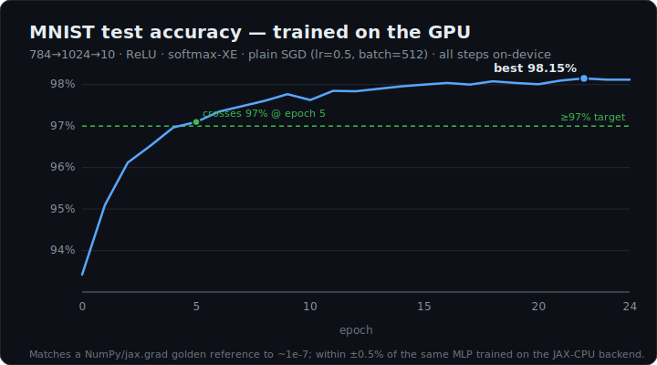
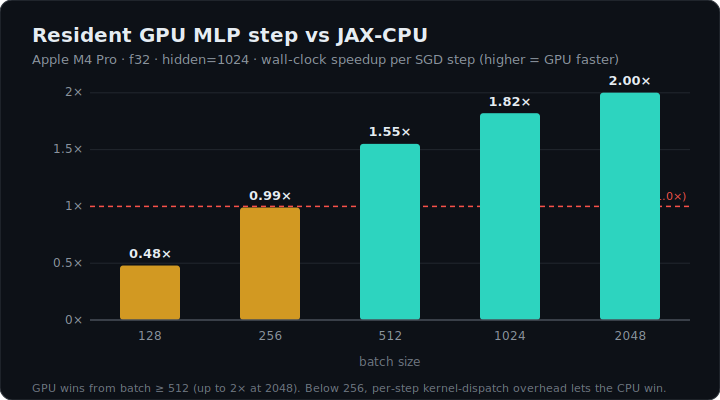

<div align="center">

# jaxmetal

**Run JAX workloads on the Apple GPU through hand-written Metal — including a full MLP that trains on MNIST, on-device and faster than CPU.**


</div>

A from-scratch, compiler-level backend that executes matmul **and a complete neural-net
training step** (forward + backprop + SGD) on Apple Silicon GPUs via hand-written **Metal
Shading Language** kernels — no MPSGraph, no ML framework, we own codegen and dispatch. Every
result is checked against a NumPy/`jax.grad` golden reference to ~1e-7.

> **Headline:** a `784→1024→10` MLP trains on MNIST **entirely on the M4 Pro GPU** to
> **98.1% test accuracy**, and its resident training step is **1.3–2.0× faster than the
> equivalent `jax.jit` step on the CPU** (Accelerate/AMX) — because every tensor stays
> GPU-resident and the whole step is one Metal command buffer.

<table>
<tr>
<td width="50%"></td>
<td width="50%"></td>
</tr>
</table>

## Highlights

- 🧠 **Trains a real MLP on MNIST on the GPU** — resident forward + backward + SGD, **98.1%**
  test accuracy, matching the CPU backend within ±0.5%.
- ⚡ **Faster than CPU where it counts** — up to **2.0×** at batch 2048; the whole
  training step is scheduled into **one Metal command buffer** (one commit, one sync).
- 🔬 **Numerically honest** — a pure-NumPy golden reference matches `jax.grad` to ~1e-8; the
  GPU matches that reference to ~1e-7, gated before every run.
- 🛠️ **Hand-written MSL kernels** — register-tiled GEMM, axis reductions, transpose, fused
  numerically-stable softmax cross-entropy, ReLU/grad, SGD — each unit-tested vs a
  double-precision CPU reference (**46 C++ tests**).
- 🔌 **Native `jax.jit` integration** via an XLA FFI custom call; a real `metal` *device*
  (PJRT) is the documented roadmap.

## Quickstart

Requires macOS on Apple Silicon + Xcode Command Line Tools + Homebrew. (Full Xcode is *not*
needed — MSL is compiled at runtime.)

```bash
# 1. Toolchain + an isolated, jaxlib-compatible Python (system Python is often too new)
brew install cmake ninja
uv venv --python 3.12 .venv
uv pip install --python .venv numpy "jax[cpu]"

# 2. Build the native runtime (with the XLA FFI handler)
cmake -S . -B build -G Ninja \
  -DJAX_FFI_INCLUDE_DIR=$(.venv/bin/python -c "import jax.ffi; print(jax.ffi.include_dir())")
cmake --build build

# 3. Train the MLP on MNIST (gate → benchmark → train), all on the GPU
.venv/bin/python examples/train_mnist.py --batch 512 --hidden 1024 --lr 0.5 --epochs 25

# 4. Tests
ctest --test-dir build --output-on-failure       # 46 C++ unit tests
.venv/bin/python tests/python/test_mlp_gate.py    # GPU MLP vs golden reference
```

Or install the Python package: `uv pip install --python .venv -e .` → `import jaxmetal`.

## The result

### Trains MNIST on the GPU

`examples/train_mnist.py` runs a correctness gate, a GPU-vs-CPU benchmark, and the SGD loop —
all with weights and activations kept GPU-resident. `784→1024→10`, ReLU, softmax
cross-entropy, plain SGD:

```
[gate] PASS   (GPU loss/grads match the NumPy golden reference)
epoch  5  train_loss=0.0926  test_acc=97.10%
epoch 15  train_loss=0.0353  test_acc=98.00%
FINAL test accuracy: 98.12%  best=98.15%   (PASS >=97%)
```

### Faster than the CPU (resident step, M4 Pro, hidden=1024)

| batch | GPU step | JAX-CPU step | speedup |
|------:|---------:|-------------:|:-------:|
| 128   | 1.41 ms  | 0.68 ms      | 0.48×   |
| 256   | 1.10 ms  | 1.09 ms      | 0.99×   |
| 512   | 1.23 ms  | 1.90 ms      | **1.55×** |
| 1024  | 1.77 ms  | 3.22 ms      | **1.82×** |
| 2048  | 3.09 ms  | 6.20 ms      | **2.00×** |

The GPU wins from batch ≥ 512. Below that, the ~15 small per-step kernel dispatches dominate
and the CPU (Accelerate/AMX, genuinely multi-threaded) wins — the same data-locality/scale
lesson that motivates keeping tensors on-device. Reproduce with
`examples/train_mnist.py --bench-only --batch <B> --hidden 1024`.

## Matmul backends

Three matmuls behind one API, plus a compute-only benchmark (`benchmarks/bench_matmul.py`,
GPU-resident operands, M4 Pro, f32):

| N | MPS (GF/s) | our MSL kernel | Accelerate CPU | MPS / CPU |
|--:|-----------:|---------------:|---------------:|:---------:|
| 1024 | 2415 | 1182 | 2272 | 1.06× |
| 2048 | 3739 | 2105 | 2553 | 1.46× |
| 4096 | **5358** | 2112 | 3092 | **1.73×** |

`jaxmetal.matmul(a, b, device="mps"|"metal"|"cpu"|"auto")` gives `jnp.matmul` semantics
(1-D/2-D/batched/broadcast) with an explicit backend. Our hand kernel reaches ~40% of MPS —
occupancy-aware 4×4 register blocking and `float4` vectorization were the big levers; Apple
GPUs have no f32 matrix unit, so `simdgroup_matrix` gave us nothing.

## How it works

```
jaxmetal (Python: matmul(device=), Mlp, ffi)  →  ctypes  →  flat C ABI (metal_mlp_*, metal_matmul_*)
   →  C++ ops (mlp / matmul / mps_matmul / nn / elementwise)  →  Metal runtime
   (MetalContext · MetalBuffer[unified] · KernelLibrary[runtime MSL compile] · Dispatcher)  →  kernels/*.metal + MPS
```

**The core design decision — one command buffer per training step.** The naive path (a
command buffer per op, plus MPS's own internal `waitUntilCompleted`) incurs ~15 commits and
5 host stalls per step and *loses* to the CPU. Instead, `train_step` encodes the full
forward + backward + SGD sequence (MPS GEMMs via `encodeToCommandBuffer:`, custom kernels via
compute encoders) into a **single command buffer**, commits once, and syncs once — Metal's
automatic hazard tracking orders the ~19 encoders, and only the scalar loss is read back.
Backward normalizes every gradient to a plain `[M,K]×[K,N]` GEMM via three explicit transpose
kernels; the `1/B` averaging is baked once into `dlogits` by the fused softmax-XE kernel.

Kernels compile with `MTLMathModeSafe`, so `+ − × ÷` are bit-exact vs the CPU reference — that
is what makes numerical parity testing possible. Full details in
[docs/ARCHITECTURE.md](docs/ARCHITECTURE.md).

## Calling it from JAX

- **`jaxmetal.ffi.matmul`** — jittable: lowers to an XLA FFI custom call and composes inside
  `jax.jit` with native JAX ops (runs on the CPU backend, copies to GPU per call). Native
  *integration*. Demo: `examples/ffi_jit.py`.
- **PJRT device** *(roadmap)* — a real `metal` device so `jax.device_put(x, metal)` keeps
  arrays resident and `jax.jit(f, backend='metal')` runs on the GPU natively (residency, and
  the win, for free). Scaffold in `jaxmetal.plugin`; see [docs/PJRT_PLUGIN.md](docs/PJRT_PLUGIN.md).

## Repository layout

```
include/jaxmetal/   public C++ headers (metal/ runtime/ ops/ cpu/ capi/)
src/                implementations: metal/ runtime/ ops/{matmul,mps_matmul,nn,mlp,…} capi/ ffi/
kernels/            hand-written MSL: elementwise · matmul · nn  (embedded, compiled at runtime)
python/jaxmetal/    package: __init__ (public API) · _capi (ctypes) · ffi · data · reference · plugin
examples/           train_mnist · backends_and_batching · jit_ffi · ffi_jit · resident_speed · matmul_showcase
benchmarks/         bench_matmul.py (MPS vs hand kernel vs CPU)
tests/cpp/          46 C++ unit tests (per-TEST ctest cases)      tests/python/  frontend + MLP gate
docs/               ARCHITECTURE.md · PJRT_PLUGIN.md · images/
```

## Roadmap

- **PJRT plugin** — a real `metal` device (`jax.jit(f, backend='metal')`) via a hand-written
  StableHLO-subset parser → kernel schedule. The residency the MLP builds by hand would then
  come for free for arbitrary JAX programs.
- **Kernel fusion** for elementwise chains; a faster hand GEMM (double-buffering); AOT
  `.metallib` when full Xcode is present.

## License

[MIT](LICENSE) © 2026 Ammar. A learning/portfolio project — not affiliated with Apple's
(abandoned) `jax-metal`.
