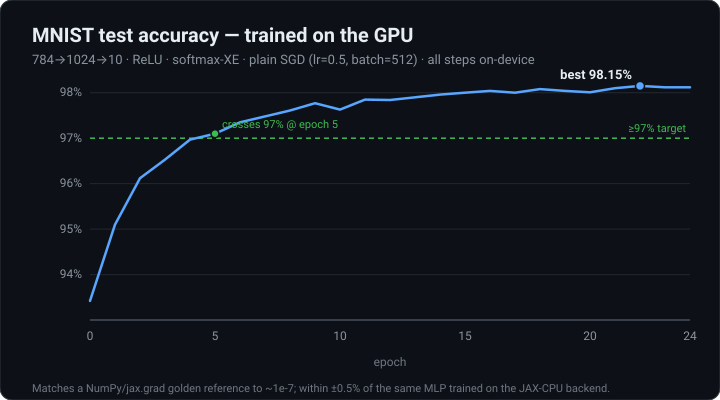
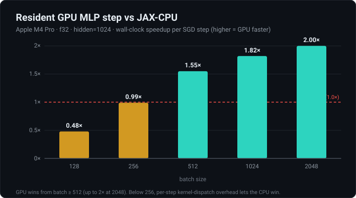

# jaxmetal

A from-scratch GPU backend for Apple Silicon, written in C++17 and Metal Shading Language. It
executes general matrix multiplication and a complete neural-network training step (forward,
backpropagation, and SGD update) on the Apple GPU, with a Python front end that integrates
with `jax.jit` through an XLA FFI custom call.


Kernels are hand-written; the project does not use MPSGraph or any existing ML framework for
codegen, scheduling, or autodiff. Every numerical result is validated against a NumPy reference
implementation that is itself checked against `jax.grad`.

## Summary of results

A `784 → 1024 → 10` MLP trains on MNIST entirely on an M4 Pro GPU to **98.15% test accuracy**.
Its GPU-resident training step is **1.6–3.2× faster than the equivalent `jax.jit` step on the
CPU** (Accelerate/AMX). The speedup comes from two design decisions: all tensors remain
GPU-resident across steps, and many consecutive SGD steps are encoded into a single Metal
command buffer, so the driver round trip is paid once per chunk rather than once per step.

<table>
<tr>
<td width="50%"></td>
<td width="50%"></td>
</tr>
</table>

## Capabilities

- **End-to-end GPU training.** Resident forward pass, backward pass, and SGD update, with many
  steps submitted per command buffer. Final accuracy matches the CPU reference implementation
  to within ±0.5%.
- **Backend routing.** `jaxmetal.Mlp(device="auto")` picks the GPU or CPU arm from a measured
  crossover model, because the GPU is not faster at every size. The CPU arm delegates to the
  NumPy golden reference, so it introduces no second implementation of the numerics.
- **Verified numerics.** A pure-NumPy golden reference agrees with `jax.grad` to approximately
  1e-8; the GPU implementation agrees with that reference to approximately 1e-7. The check runs
  as a gate before every training run.
- **Hand-written MSL kernel set.** Register-tiled GEMM, axis reductions, transpose, fused
  numerically stable softmax cross-entropy, ReLU and its gradient, and the SGD update. Each is
  unit-tested against a double-precision CPU implementation across 46 C++ tests.
- **JAX integration.** `jaxmetal.ffi.matmul` lowers to an XLA FFI custom call and composes with
  native JAX operations inside `jax.jit`. A PJRT plugin exposing a real `metal` device is
  specified but not yet implemented; see [Roadmap](#roadmap).

## Requirements

macOS on Apple Silicon, Xcode Command Line Tools, and Homebrew. Full Xcode is not required, as
Metal Shading Language is compiled at runtime.

## Build and run

```bash
# 1. Toolchain and an isolated, jaxlib-compatible interpreter.
#    The system Python is frequently too new for the pinned jaxlib.
brew install cmake ninja
uv venv --python 3.12 .venv
uv pip install --python .venv numpy "jax[cpu]"

# 2. Build the native runtime, including the XLA FFI handler.
cmake -S . -B build -G Ninja \
  -DJAX_FFI_INCLUDE_DIR=$(.venv/bin/python -c "import jax.ffi; print(jax.ffi.include_dir())")
cmake --build build

# 3. Train the MLP on MNIST: correctness gate, benchmark, then the SGD loop.
.venv/bin/python examples/train_mnist.py --batch 512 --hidden 1024 --lr 0.5 --epochs 25

# 4. Run the test suites.
ctest --test-dir build --output-on-failure        # 46 C++ unit tests
.venv/bin/python tests/python/test_mlp_gate.py    # GPU MLP against the golden reference
.venv/bin/python tests/python/test_mlp_auto.py    # chunked == per-step; router against the clock
```

To install the Python package: `uv pip install --python .venv -e .`, then `import jaxmetal`.

## Benchmarks

### MNIST training

`examples/train_mnist.py` runs the correctness gate, a GPU-versus-CPU benchmark, and the
training loop, holding weights and activations on the GPU throughout. Architecture:
`784 → 1024 → 10` with ReLU activations, softmax cross-entropy loss, and plain SGD.

```
[gate] PASS   (GPU loss and gradients match the NumPy golden reference)
epoch  5  train_loss=0.0926  test_acc=97.10%
epoch 15  train_loss=0.0353  test_acc=98.00%
FINAL test accuracy: 98.12%  best=98.15%   (PASS >= 97%)
```

### Training step latency

Measured on an M4 Pro. Reproduce with
`examples/train_mnist.py --bench-only --batch <B> --hidden <H>`, or sweep both backends with
`examples/train_mnist.py --calibrate`.

| Batch | `hidden=128` GPU | CPU | Speedup | `hidden=1024` GPU | CPU | Speedup |
|------:|-----------------:|----:|:-------:|------------------:|----:|:-------:|
| 32    | 0.124 ms | 0.097 ms | 0.79× | 0.200 ms | 0.319 ms | 1.60× |
| 128   | 0.137 ms | 0.179 ms | 1.31× | 0.274 ms | 0.664 ms | 2.42× |
| 512   | 0.206 ms | 0.446 ms | 2.17× | 0.605 ms | 1.827 ms | 3.02× |
| 2048  | 0.496 ms | 1.382 ms | 2.79× | 2.023 ms | 6.400 ms | 3.16× |

The binding constraint was submission overhead, not arithmetic intensity. Profiling a single
step (`JAXMETAL_PROFILE=1`) decomposes its 0.446 ms into roughly 140 µs of driver round trip,
100 µs of CPU-side encoding, and 124 µs of GPU execution — a fixed floor that dominated the
compute and kept the GPU behind the CPU until batch 1000 or so at `hidden=128`. Batching many
SGD steps into one command buffer, caching the MPS kernel and matrix objects, using the MPS
transpose flags instead of materialising transposes, coalescing compute encoders, and
parallelising the bias-gradient reduction together cut per-step time by about 4.4× and moved
the crossover to roughly batch 60 at `hidden=128`.

Below that crossover the CPU still wins, and that is a hard limit rather than a missing
optimisation: a Metal command buffer round trip does not go below about 95 µs, while the whole
CPU step at batch 1 takes about 20 µs. `jaxmetal.Mlp(device="auto")` therefore routes to
whichever backend a measured cost model favours, reports the choice on `.device`, and can be
re-fitted on other hardware with `--calibrate` or overridden with `JAXMETAL_MLP_DEVICE`.

### Matrix multiplication

Three backends sit behind one API. Compute-only measurements from
`benchmarks/bench_matmul.py`, with GPU-resident operands, M4 Pro, f32:

| N | MPS (GFLOP/s) | Hand-written MSL | Accelerate (CPU) | MPS / CPU |
|--:|--------------:|-----------------:|-----------------:|:---------:|
| 1024 | 2415 | 1182 | 2272 | 1.06× |
| 2048 | 3739 | 2105 | 2553 | 1.46× |
| 4096 | 5358 | 2112 | 3092 | 1.73× |

`jaxmetal.matmul(a, b, device="mps"|"metal"|"cpu"|"auto")` provides `jnp.matmul` semantics
(1-D, 2-D, batched, and broadcast cases) with explicit backend selection. The hand-written
kernel reaches roughly 40% of MPS throughput. Occupancy-aware 4×4 register blocking and
`float4` vectorisation produced the largest gains; `simdgroup_matrix` produced none, as Apple
GPUs have no f32 matrix unit.

## Design

```
jaxmetal (Python: matmul(device=), Mlp, ffi)  ->  ctypes  ->  flat C ABI (metal_mlp_*, metal_matmul_*)
   ->  C++ ops (mlp / matmul / mps_matmul / nn / elementwise)  ->  Metal runtime
   (MetalContext, MetalBuffer [unified], KernelLibrary [runtime MSL compilation], Dispatcher)
   ->  kernels/*.metal and MPS
```

**One command buffer per training step.** The naive implementation, allocating a command buffer
per operation and inheriting MPS's internal `waitUntilCompleted`, incurs roughly 15 commits and
5 host stalls per step and is slower than the CPU. Instead, `train_step` encodes the full
forward, backward, and SGD sequence into a single command buffer, using
`encodeToCommandBuffer:` for MPS GEMMs and compute encoders for the custom kernels. It commits
once and synchronises once. Metal's automatic hazard tracking orders the roughly 19 encoders,
and only the scalar loss is read back to the host.

The backward pass normalises every gradient to a plain `[M,K] × [K,N]` GEMM using three
explicit transpose kernels. The `1/B` averaging is folded once into `dlogits` inside the fused
softmax cross-entropy kernel rather than applied as a separate pass.

Kernels are compiled with `MTLMathModeSafe`, which makes `+`, `-`, `×`, and `÷` bit-exact
against the CPU reference. This is what makes strict numerical parity testing feasible, at some
cost in throughput. Full details are in [docs/ARCHITECTURE.md](docs/ARCHITECTURE.md).

## Using it from JAX

- **`jaxmetal.ffi.matmul`** is jittable. It lowers to an XLA FFI custom call and composes with
  native JAX operations inside `jax.jit`. Note the limitation: the surrounding computation runs
  on the CPU backend, so operands are copied to the GPU on each call. Demonstrated in
  `examples/ffi_jit.py`.
- **PJRT device (planned).** A real `metal` device would let `jax.device_put(x, metal)` keep
  arrays resident and `jax.jit(f, backend='metal')` execute natively on the GPU, providing
  residency, and therefore the performance win, without manual scheduling. A scaffold exists in
  `jaxmetal.plugin`; the design is in [docs/PJRT_PLUGIN.md](docs/PJRT_PLUGIN.md).

## Scope and limitations

- f32 only. No mixed precision, and no f16 or bf16 paths.
- SGD only. No momentum, Adam, or weight decay.
- The MLP training step is hand-scheduled. Residency is a property of that specific
  implementation, not a general capability of the backend.
- The FFI path does not keep data resident across calls; only the hand-written MLP path does.
- Benchmarks are single-machine results from one M4 Pro and have not been validated across
  other Apple Silicon configurations.

## Repository layout

```
include/jaxmetal/   Public C++ headers (metal/, runtime/, ops/, cpu/, capi/)
src/                Implementations: metal/, runtime/, ops/{matmul,mps_matmul,nn,mlp,...}, capi/, ffi/
kernels/            Hand-written MSL: elementwise, matmul, nn (embedded, compiled at runtime)
python/jaxmetal/    Package: __init__ (public API), _capi (ctypes), ffi, data, reference, plugin
examples/           train_mnist, backends_and_batching, jit_ffi, ffi_jit, resident_speed, matmul_showcase
benchmarks/         bench_matmul.py (MPS versus hand-written kernel versus CPU)
tests/cpp/          46 C++ unit tests, exposed as individual ctest cases
tests/python/       Front-end tests, the MLP correctness gate, and the router gate
docs/               ARCHITECTURE.md, PJRT_PLUGIN.md, images/
```

## Roadmap

- **PJRT plugin.** A real `metal` device supporting `jax.jit(f, backend='metal')`, implemented
  as a hand-written StableHLO-subset parser that lowers to a kernel schedule. This would extend
  the residency the MLP currently achieves by hand to arbitrary JAX programs.
- **Kernel fusion** for elementwise chains.
- **Faster hand-written GEMM** via double-buffered shared-memory loads.
- **Ahead-of-time `.metallib` compilation** when full Xcode is available.

## License

[MIT](LICENSE) © 2026 Ammar.

A learning and portfolio project. Not affiliated with Apple's discontinued `jax-metal`.
